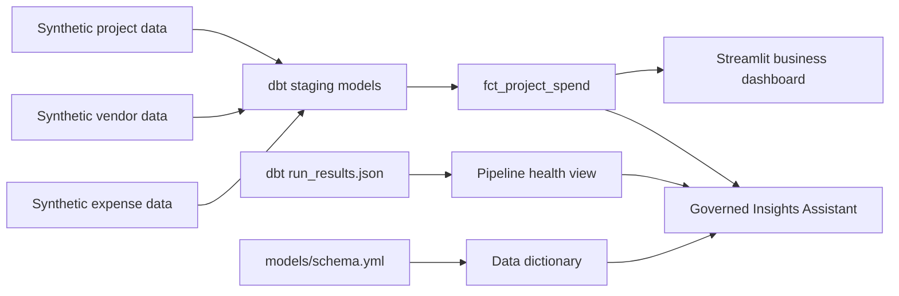

# PlacesOps: Construction & Corporate Analytics Hub


**Live Demo:** [Live App](https://places-ops.streamlit.app/)

PlacesOps is a lightweight, production-minded proof of concept for construction and corporate operations analytics. It models project, vendor, budget, and expense data into a dashboard that helps business stakeholders understand budget variance, delayed-project exposure, cost categories, and vendor reliability while giving data engineers visibility into pipeline health.

The data is synthetic. The project is designed to mirror the shape of enterprise analytics work without using or implying access to company-private data.

## Vision

Large operating companies need reliable analytics across many business domains: finance, HR, legal, marketing, construction, vendor management, and cost optimization. The hard part is not only building dashboards. It is creating trusted data products from messy operational systems, keeping definitions consistent, and making the platform observable enough that business users can trust the numbers.

The vision for PlacesOps is a small but realistic enterprise analytics hub:

- ingest operational data from projects, vendors, and expenses,
- standardize it through staging models,
- publish dashboard-ready marts,
- track business metrics such as budget variance and delayed-project exposure,
- expose dbt pipeline health and data documentation,
- and provide a foundation for governed AI dashboards over trusted metrics.

The project is intentionally compact, but the design choices reflect production-grade habits: modular modeling, business-friendly metrics, documented data assets, quality checks, and operational telemetry.

## Who It Is Built For

This project is built for teams that need to turn cross-functional operational data into reliable decisions:

- **Corporate analytics teams** supporting finance, marketing, HR, legal, construction operations, and leadership reporting.
- **Business stakeholders** who need fast answers about budget performance, project risk, vendor reliability, and cost drivers.
- **Data engineering teams** responsible for dbt models, warehouse marts, pipeline health, data quality, and BI enablement.
- **AI product teams** exploring governed dashboards and natural-language analytics over approved business metrics.

## What It Shows

The Streamlit app serves two audiences:

- **Executive Operations:** portfolio KPIs for projects, total spend, budget variance, delayed-project exposure, regional spend, and executive interpretation.
- **Cost & Vendor Risk:** cost categories, daily spend trend, vendor reliability thresholding, and operational risk queues.
- **Platform Health:** dbt run artifacts, execution telemetry, success rate, model/test observability, and governed platform insight.
- **Dictionary:** governed business metric definitions plus current dbt model and column documentation from `models/schema.yml`.
- **Insights Assistant:** governed natural-language analysis over portfolio, vendor, delayed exposure, category, regional, and pipeline-health questions with contextual charts and trace metadata.

The project demonstrates common enterprise analytics patterns:

- staging models for raw operational sources,
- a final fact mart for project spend analytics,
- BI-ready metrics for executive and operational dashboards,
- data documentation generated from transformation metadata,
- engineering telemetry that makes pipeline reliability visible,
- and governed AI-style access to trusted metrics without relying on external API quotas.

## Why This Maps to Lennar

Lennar's Data Engineer II role emphasizes AWS, Snowflake, dbt, SQL/Python, Qlik, business insights, reporting platforms, cost efficiency, cross-functional analytics, and AI initiatives. The team context also includes corporate analytics, finance, HR, legal, marketing, cost optimization, MCPs, in-house AI products, and AI-powered dashboards.

PlacesOps mirrors that environment in a focused local prototype:

- construction and budget data are modeled into business-ready metrics,
- vendor and delayed-project risk are surfaced for operational decision-making,
- dbt-style transformations and documentation support governed analytics,
- pipeline health is visible alongside the business dashboard,
- and the project creates a natural foundation for AI-assisted dashboards over approved metrics.

The intent is to show an ability to reason from business requirements to a working data product, not just build isolated ETL scripts.

## Technology Stack

Built locally with:

- **Python:** mock data generation and application logic.
- **DuckDB:** local analytical warehouse for fast OLAP-style development.
- **dbt Core:** staging models, mart modeling, tests, documentation, and artifact generation.
- **Streamlit:** interactive BI and engineering-health dashboard.
- **Altair/Pandas:** charts and analytical transformations in the app.

Mirrors a production environment with:

- **AWS S3:** raw and curated data landing zones.
- **AWS Glue:** cataloging and transformation jobs.
- **AWS Lambda or Step Functions:** lightweight orchestration and event-driven workflows.
- **Snowflake:** enterprise warehouse for governed marts and BI serving.
- **dbt:** transformation DAG, tests, docs, semantic definitions, and CI checks.
- **Qlik or Power BI:** governed BI dashboards for business users.
- **CloudWatch or similar observability:** freshness, failures, model runtimes, and operational alerts.
- **MCP or approved AI services:** natural-language access to trusted metrics and documented marts.

## Architecture



## Run It Locally

```bash
git clone https://github.com/ravi-rajpurohit-gh/places-ops.git
cd places-ops
python generate_mock_data.py
cd apple_places
dbt build --profiles-dir .
pip install -r requirements.txt
streamlit run app.py
```

Track goals, decisions, lifecycle, and progress in [docs/LENNAR_TRACKER.md](docs/LENNAR_TRACKER.md), [docs/CASE_STUDY.md](docs/CASE_STUDY.md), [docs/PORTFOLIO_BRIEF.md](docs/PORTFOLIO_BRIEF.md), and [docs/ENGINEERING_NOTES.md](docs/ENGINEERING_NOTES.md).

## Project Checkpoint

As of 2026-05-26, PlacesOps is in a portfolio-ready checkpoint state:

- the Streamlit app is reframed as a construction and corporate analytics command center,
- generated data uses neutral operating regions instead of company-specific campuses,
- DuckDB tables are refreshed from generated project, vendor, and expense data,
- dbt artifacts show 14 passing nodes/tests,
- the assistant answers governed natural-language questions with contextual charts and trace metadata,
- governed insight panels appear across Executive Operations, Cost & Risk, Platform Health, and Dictionary,
- the Dictionary tab includes business metric definitions plus current `schema.yml` model documentation,
- tracker, case study, portfolio brief, engineering notes, changelog, root README, and app README are aligned.

## 30-Second Recruiter Pitch

> I recently built a dbt + Streamlit operations analytics prototype around construction projects, vendors, budgets, and pipeline health. It felt close to the cross-functional analytics work Connor described: taking messy operational data, modeling it into trusted business metrics, and giving both business users and engineers visibility into performance and reliability.

## What This Demonstrates About My Approach

- I can translate ambiguous business domains into clear analytical models and dashboards.
- I think about data products end to end: ingestion, modeling, metrics, documentation, dashboarding, observability, and production migration.
- I understand that enterprise analytics must serve both business users and engineering operators.
- I can quickly ideate and build production-grade proof of concepts around modern data and AI patterns.
- I treat AI dashboards as governed interfaces over trusted metrics, not free-form access to unvalidated data.
