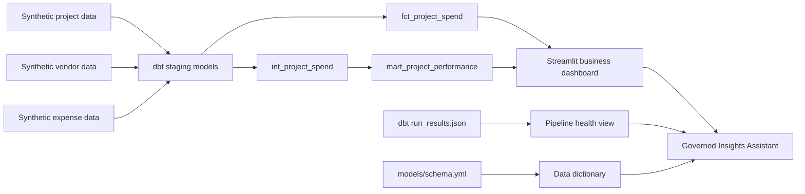

# PlacesOps: Construction & Corporate Analytics Hub


**Live App:** [places-ops.streamlit.app](https://places-ops.streamlit.app/)

PlacesOps is a construction and corporate operations analytics reference implementation. It models project, vendor, budget, and expense data into governed analytical datasets and an operations dashboard that helps business stakeholders understand budget variance, delayed-project exposure, cost categories, and vendor reliability while giving data engineers visibility into pipeline health.

The data is synthetic. The project is designed to mirror the shape of enterprise analytics work without using or implying access to company-private data.

## Vision

Large operating companies need reliable analytics across many business domains: finance, HR, legal, marketing, construction, vendor management, and cost optimization. The hard part is not only building dashboards. It is creating trusted data products from messy operational systems, keeping definitions consistent, and making the platform observable enough that business users can trust the numbers.

The vision for PlacesOps is a small but realistic enterprise analytics hub:

- ingest operational data from projects, vendors, and expenses,
- standardize it through staging models,
- publish dashboard-ready marts,
- track business metrics such as budget variance and delayed-project exposure,
- expose dbt pipeline health and data documentation,
- and provide a foundation for governed AI dashboards over trusted metrics.

The project is intentionally compact and locally executable. Its design emphasizes production data-engineering practices: modular modeling, explicit data grain, governed business metrics, documented data contracts, automated quality checks, lineage, CI, and operational telemetry.

## Who It Is Built For

This project is built for teams that need to turn cross-functional operational data into reliable decisions:

- **Corporate analytics teams** supporting finance, marketing, HR, legal, construction operations, and leadership reporting.
- **Business stakeholders** who need fast answers about budget performance, project risk, vendor reliability, and cost drivers.
- **Data engineering teams** responsible for dbt models, warehouse marts, pipeline health, data quality, and BI enablement.
- **AI product teams** exploring governed dashboards and natural-language analytics over approved business metrics.

## What It Shows

The Streamlit app serves two audiences:

- **Executive Operations:** portfolio KPIs for projects, total spend, budget variance, delayed-project exposure, regional spend, and executive interpretation.
- **Cost & Vendor Risk:** cost categories, daily spend trend, vendor reliability thresholding, and operational risk queues.
- **Platform Health:** dbt artifact telemetry when available, project-defined model/test inventory as a public-app fallback, and governed platform insight.
- **Dictionary:** governed business metric definitions plus current dbt model and column documentation from `models/schema.yml`.
- **Insights Assistant:** governed natural-language analysis over portfolio, vendor, delayed exposure, category, regional, and pipeline-health questions with contextual charts and trace metadata.

The project demonstrates common enterprise analytics patterns:

- staging models for raw operational sources,
- an intermediate project-spend aggregate plus expense-grain and project-grain marts,
- reusable Jinja macros and project variables for governed budget logic,
- generic, relationship, and reconciliation tests across model grains,
- an SCD Type 2 snapshot for project status and budget history,
- a dbt exposure connecting marts to the PlacesOps dashboard,
- BI-ready metrics for executive and operational dashboards,
- data documentation generated from transformation metadata,
- engineering telemetry that makes pipeline reliability visible,
- and governed AI-style access to trusted metrics without relying on external API quotas.

## Engineering Scope

PlacesOps mirrors the kind of analytics platform work common in large operating companies:

- construction and budget data are modeled into business-ready metrics,
- vendor and delayed-project risk are surfaced for operational decision-making,
- dbt-style transformations and documentation support governed analytics,
- pipeline health is visible alongside the business dashboard,
- and the project creates a natural foundation for AI-assisted dashboards over approved metrics.

PlacesOps is a reference implementation, not a claim of operating a production Snowflake deployment. DuckDB and synthetic data keep local execution deterministic and accessible; the repository documents the controls and architectural changes required to operate the same modeling approach with enterprise source systems and Snowflake.

## Technology Stack

Built locally with:

- **Python:** mock data generation and application logic.
- **DuckDB:** local analytical warehouse for fast OLAP-style development.
- **dbt Core:** staging models, mart modeling, tests, documentation, and artifact generation.
- **Streamlit:** interactive BI and engineering-health dashboard.
- **Altair/Pandas:** charts and analytical transformations in the app.

Mirrors a production environment with:

- **AWS S3:** raw and curated data landing zones.
- **AWS Glue:** cataloging and transformation jobs.
- **AWS Lambda or Step Functions:** lightweight orchestration and event-driven workflows.
- **Snowflake:** enterprise warehouse for governed marts and BI serving.
- **dbt:** transformation DAG, tests, docs, semantic definitions, and CI checks.
- **Qlik or Power BI:** governed BI dashboards for business users.
- **CloudWatch or similar observability:** freshness, failures, model runtimes, and operational alerts.
- **MCP or approved AI services:** natural-language access to trusted metrics and documented marts.

## Architecture



## Run It Locally

```bash
git clone https://github.com/ravi-rajpurohit-gh/places-ops.git
cd places-ops
python generate_mock_data.py
cd app
dbt build --profiles-dir .
pip install -r requirements.txt
streamlit run app.py
```

The generator defaults to random seed `42`; pass `--as-of-date YYYY-MM-DD` when an exact repeatable date window is required.

Engineering decisions, operations, and lifecycle history are documented in [docs/ENGINEERING_NOTES.md](docs/ENGINEERING_NOTES.md), [docs/DBT_IMPLEMENTATION_GUIDE.md](docs/DBT_IMPLEMENTATION_GUIDE.md), [docs/PROJECT_TRACKER.md](docs/PROJECT_TRACKER.md), and [docs/CASE_STUDY.md](docs/CASE_STUDY.md).

## Current Release

As of 2026-06-10, the current PlacesOps release includes:

- the Streamlit app is reframed as a construction and corporate analytics command center,
- generated data uses neutral operating regions instead of company-specific campuses,
- DuckDB tables are refreshed from generated project, vendor, and expense data,
- the dbt DAG includes reusable Jinja macros, an intermediate model, two marts, an SCD Type 2 snapshot, a dashboard exposure, and CI,
- dbt artifacts show `PASS=59 WARN=0 ERROR=0 SKIP=0`,
- the assistant answers governed natural-language questions with contextual charts and trace metadata,
- governed insight panels appear across Executive Operations, Cost & Risk, Platform Health, and Dictionary,
- the Dictionary tab includes business metric definitions plus current `schema.yml` model documentation,
- tracker, case study, implementation guide, engineering notes, changelog, root README, and app README are aligned.
