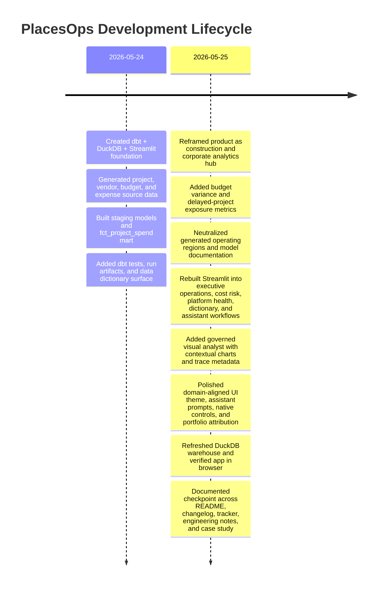
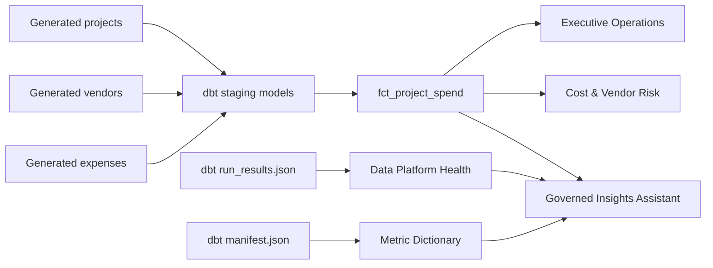

# PlacesOps Case Study

## Overview

PlacesOps is a production-minded analytics application for transforming construction, vendor, budget, and expense data into trusted corporate operations insights. It combines dbt modeling, data quality, dashboarding, dbt artifact observability, generated documentation, and governed natural-language analysis in one compact product surface.

The application is designed around a realistic enterprise analytics pattern: operational source data is standardized through staging models, joined into a trusted spend mart, monitored through dbt artifacts, and consumed through business dashboards, metric documentation, and governed AI-assisted workflows.

## Product Goals

- Turn project, vendor, and expense records into reliable spend and risk metrics.
- Make budget variance, delayed-project exposure, cost categories, regional spend, and vendor reliability easy to inspect.
- Treat dbt pipeline health and documentation as part of the data product.
- Provide natural-language access to approved metrics without unrestricted SQL generation.
- Preserve a clear migration path to AWS, Snowflake, dbt, Qlik/Power BI, observability, and approved AI/MCP tooling.

## Lifecycle Timeline

## Delivery Phases

| Phase | Outcome | Evidence |
| --- | --- | --- |
| Product Framing | Defined the analytics hub vision, users, business metrics, and production mapping. | Root README and app README. |
| Data Generation | Created privacy-safe project, vendor, and expense records. | `generate_mock_data.py` and `raw_data/`. |
| Data Modeling | Built staging models and a project spend fact mart. | `apple_places/models/`. |
| Quality & Observability | Added dbt tests, run artifacts, success-rate metrics, and runtime telemetry. | `schema.yml`, `target/run_results.json`, Data Platform Health tab. |
| Business Analytics | Added executive KPIs, region spend, budget variance, delayed exposure, cost categories, and vendor reliability risk. | Streamlit app tabs. |
| Governed AI Workflow | Added natural-language routing to approved analytical functions with chart responses and trace metadata. | Insights Assistant tab in `apple_places/app.py`. |
| UX Theming | Styled the app around a warm construction/corporate analytics visual system with dark controls and production-style assistant prompts. | `CUSTOM_CSS` and Streamlit app surface. |
| Documentation | Added tracker, engineering notes, changelog, and case study checkpoint. | `docs/` and `CHANGELOG.md`. |

## Decision Log

| Decision | Rationale | Tradeoff |
| --- | --- | --- |
| Keep the app as one Streamlit surface | The product is easier to scan across business, engineering, documentation, and assistant workflows. | A larger long-lived product may eventually benefit from separate pages. |
| Use DuckDB locally | Enables fast local development and a portable warehouse artifact. | Production would move marts to Snowflake. |
| Use dbt artifacts in the app | Shows that pipeline health and documentation are part of the product experience. | Artifact freshness depends on dbt build discipline. |
| Use a governed assistant router | Gives natural-language access without API keys, quota failures, or hallucinated metrics. | It is deterministic rather than fully open-ended. |
| Add contextual assistant charts | Makes answers more useful and closer to AI-powered dashboards. | Charts are limited to approved routes. |
| Neutralize generated regions | Keeps the project public, reusable, and portfolio-safe. | It is representative rather than tied to a real operating portfolio. |

## Architecture

## Validation Strategy

- Unique and non-null tests protect project, vendor, expense, and fact-table keys.
- Accepted-value tests validate project status values.
- Not-null tests protect spend amounts.
- dbt run artifacts expose model/test results and runtime telemetry.
- Browser smoke testing verifies the business dashboard and assistant surface.
- Warehouse verification confirms generated neutral regions are reflected in `fct_project_spend`.

## Production Evolution

| Local Implementation | Production Direction |
| --- | --- |
| CSV source files | ERP, finance, procurement, construction/project systems, and corporate SaaS sources |
| DuckDB | Snowflake |
| dbt Core | dbt jobs, CI, exposures, docs, tests, and semantic definitions |
| Streamlit | Qlik/Power BI, internal analytics portal, or governed data app |
| dbt artifacts | Orchestration metadata, lineage, observability, and alerting |
| Governed assistant router | MCP/approved AI workflow over certified metrics and documentation |

## Checkpoint

As of 2026-05-25, PlacesOps is in a stable enhancement checkpoint:

- app has five product workflows,
- generated data and warehouse artifact use neutral operating regions,
- dbt artifacts report 14 passing nodes/tests,
- assistant answers questions with text, visuals, and trace metadata,
- UI uses a domain-aligned production theme with dark controls and portfolio attribution at `ravirajpurohit.com`,
- documentation is aligned across README, tracker, engineering notes, changelog, and case study,
- remaining work is optional polish or deployment rather than core functionality.
