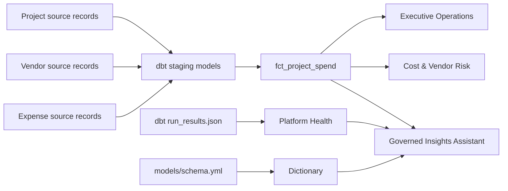
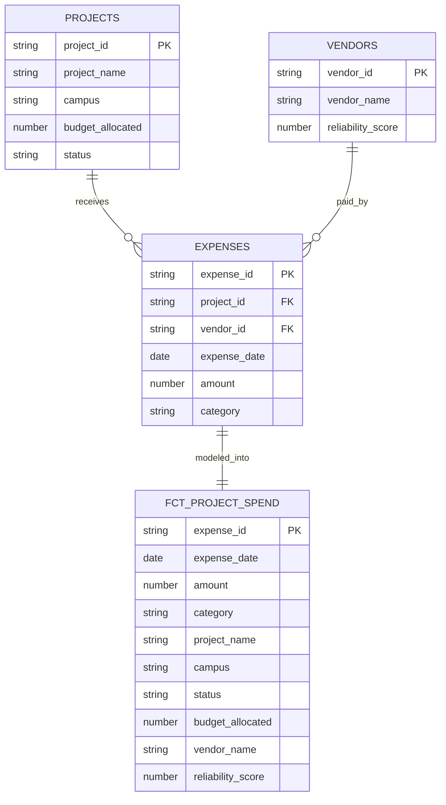
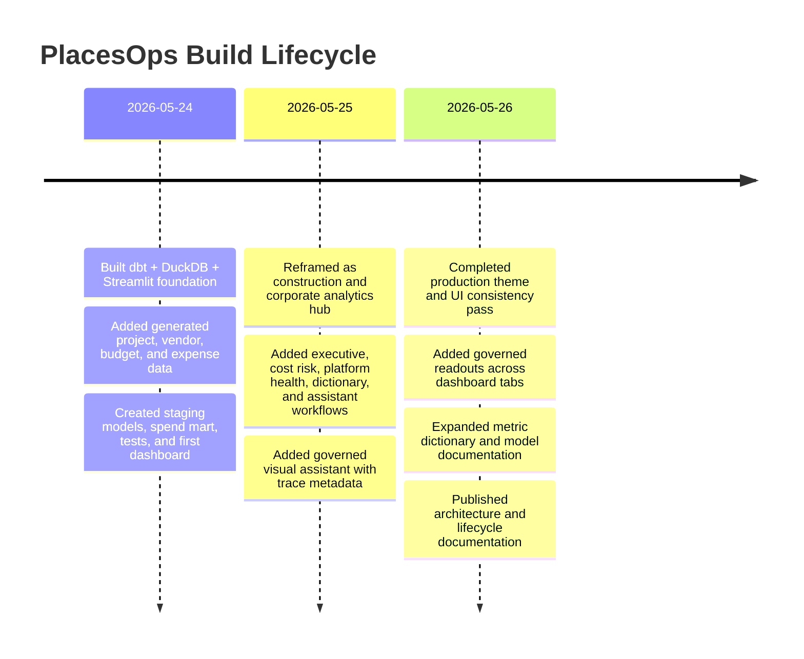

# PlacesOps System Overview

## One-Line Summary

PlacesOps is a construction and corporate analytics command center that turns project, vendor, budget, and expense data into trusted metrics, platform-health visibility, and governed AI-assisted dashboard insights.

## Case Study Narrative

Operations analytics often fails when business dashboards, data quality, documentation, and platform health are treated as separate concerns. PlacesOps treats them as one product surface: the same app that shows spend, delayed exposure, cost categories, and vendor reliability also shows dbt health, metric definitions, model documentation, and governed natural-language analysis.

The project is compact by design, but the architecture mirrors production data engineering patterns: source-aligned staging models, a reusable intermediate aggregate, expense and project marts, Jinja macros, tested data contracts, artifact observability, and an AI layer constrained to trusted definitions.

## Tech Stack

| Layer | Local Implementation | Production Analogue |
| --- | --- | --- |
| Source data | Generated project, vendor, and expense records | ERP, procurement, construction systems, finance exports |
| Storage/warehouse | DuckDB | Snowflake |
| Transformations | dbt Core staging and mart models | dbt jobs, CI, docs, tests, semantic layer |
| App layer | Streamlit | Qlik, Power BI, internal analytics portal, governed data app |
| Visualization | Altair and custom Streamlit UI | BI dashboards and operational analytics views |
| Observability | dbt `run_results.json` | CloudWatch, Datadog, Airflow/Step Functions, warehouse telemetry |
| AI workflow | Governed function router | Approved AI/MCP service over certified metrics |

## Architecture

## Data Model

## Lifecycle

## Technical Review Points

- Built an end-to-end analytics product, not only a dashboard.
- Modeled operational data into a trusted fact mart with dbt.
- Combined business metrics and engineering health in one surface.
- Added governed AI patterns without relying on unstable API quotas or hallucinated SQL.
- Documented the project as a production migration path from DuckDB/Streamlit to Snowflake/dbt/Qlik or Power BI/AWS observability.
